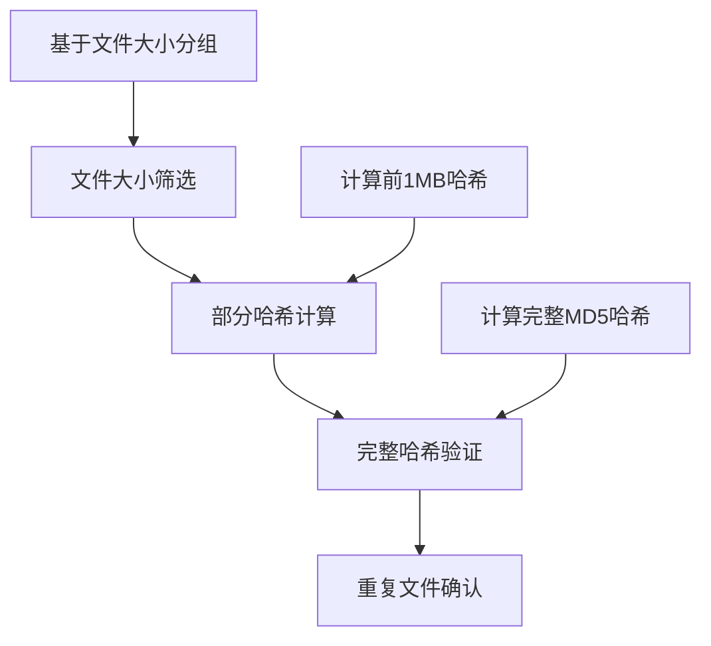
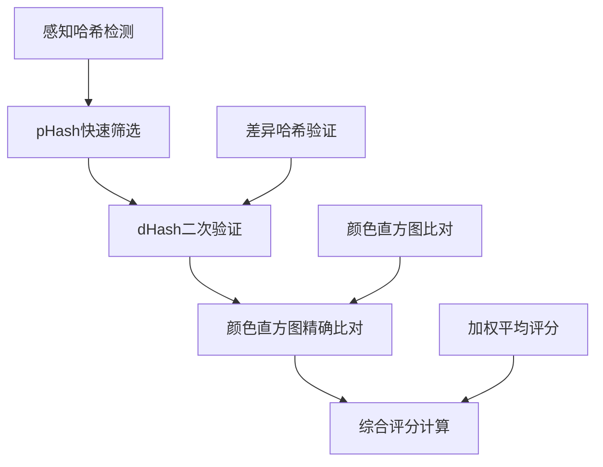
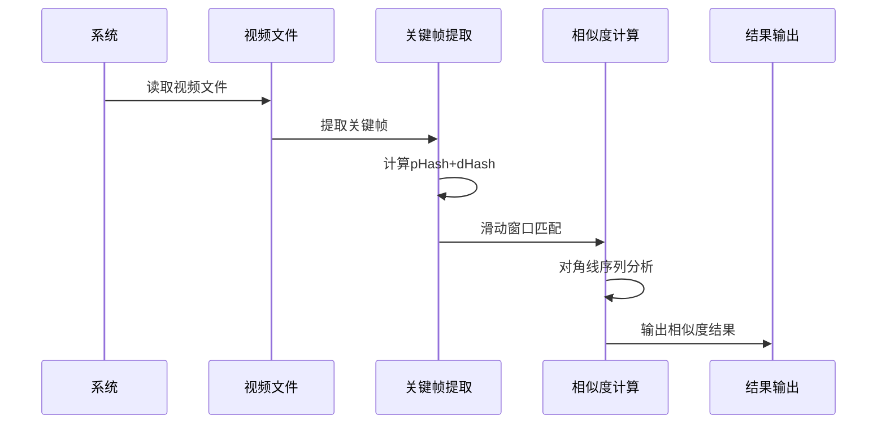
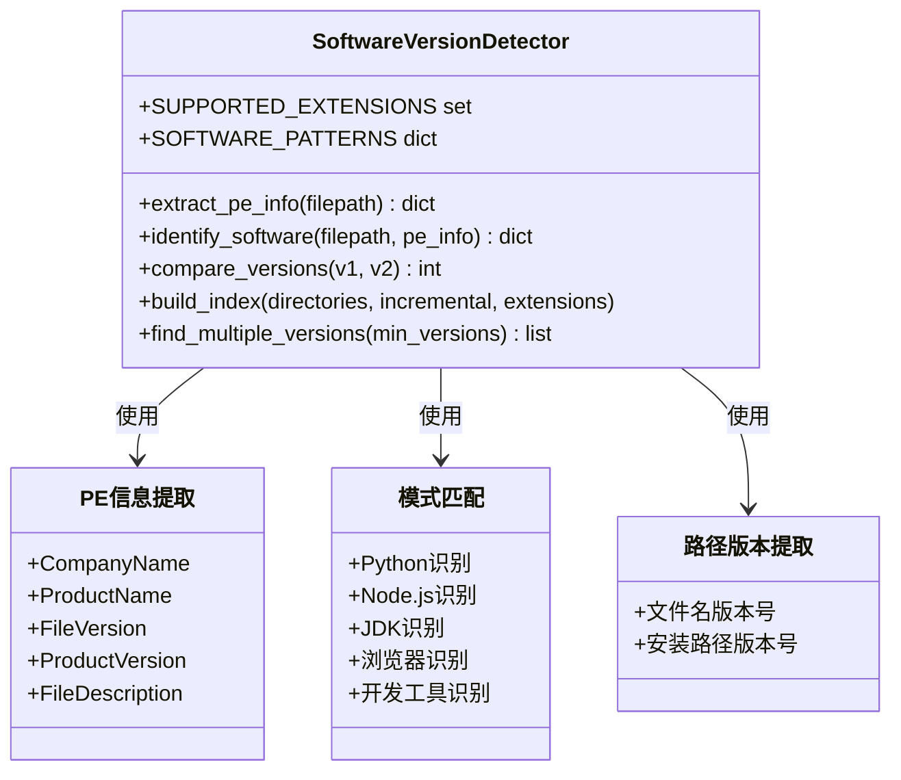
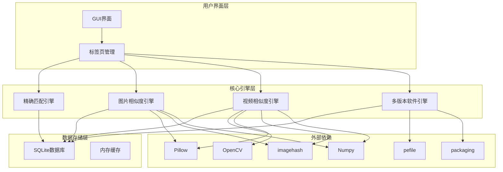
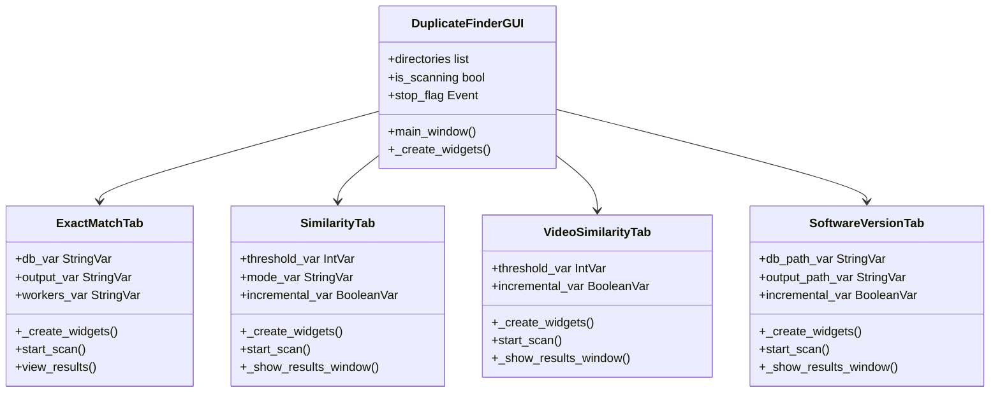
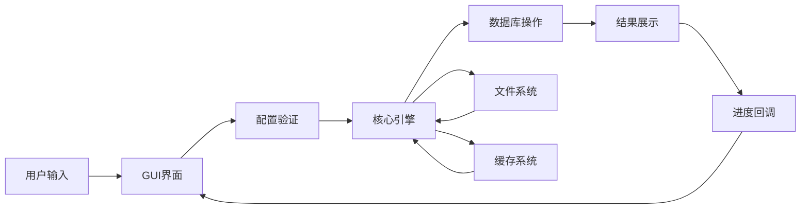
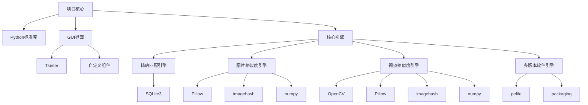
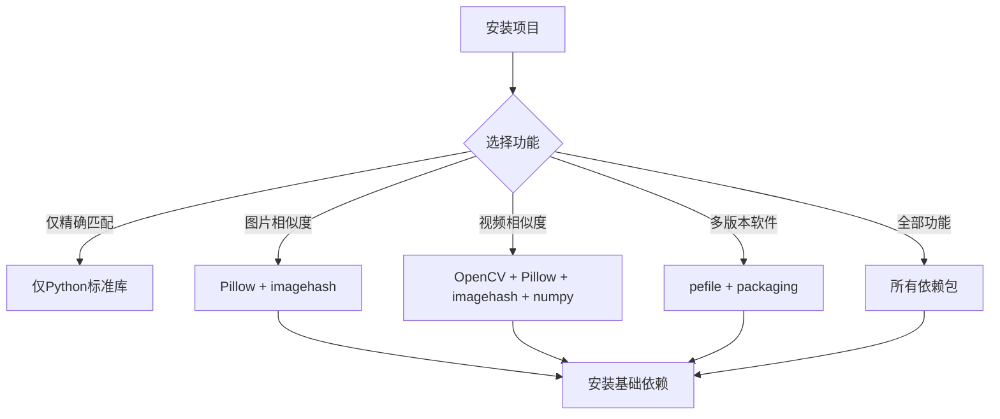

# 项目概述

<cite>
**本文档引用的文件**
- [README.md](file://README.md)
- [QUICK_START.md](file://QUICK_START.md)
- [run_gui.py](file://run_gui.py)
- [requirements.txt](file://requirements.txt)
- [core/duplicate_finder.py](file://core/duplicate_finder.py)
- [core/visual_similarity.py](file://core/visual_similarity.py)
- [core/video_similarity.py](file://core/video_similarity.py)
- [core/software_version_detector.py](file://core/software_version_detector.py)
- [gui_modules/main_window.py](file://gui_modules/main_window.py)
- [gui_modules/exact_match_tab.py](file://gui_modules/exact_match_tab.py)
- [gui_modules/similarity_tab.py](file://gui_modules/similarity_tab.py)
- [gui_modules/video_similarity_tab.py](file://gui_modules/video_similarity_tab.py)
- [gui_modules/software_version_tab.py](file://gui_modules/software_version_tab.py)
</cite>

## 目录
1. [项目简介](#项目简介)
2. [核心价值](#核心价值)
3. [四大核心功能](#四大核心功能)
4. [技术架构设计](#技术架构设计)
5. [版本演进历程](#版本演进历程)
6. [性能基准数据](#性能基准数据)
7. [系统要求](#系统要求)
8. [许可证信息](#许可证信息)
9. [适用场景](#适用场景)
10. [技术优势](#技术优势)
11. [依赖关系分析](#依赖关系分析)
12. [故障排除指南](#故障排除指南)
13. [结论](#结论)

## 项目简介

文件重复校验工具是一个功能强大的智能文件去重解决方案，基于内容识别技术，专为TB级大规模数据去重而设计。该项目采用模块化架构，支持四种不同的检测模式，能够精准识别完全相同的文件、相似的图片、相似的视频，以及同一软件的不同版本。

项目采用多级过滤策略和多进程并行计算技术，结合SQLite数据库索引优化，实现了高性能的文件重复检测功能。无论是个人用户的备份文件清理，还是企业级的大规模数据去重需求，都能提供高效的解决方案。

## 核心价值

### 高性能处理能力
- **多进程并行计算**：充分利用多核CPU资源，显著提升处理速度
- **智能缓存机制**：SQLite数据库索引，支持增量扫描，避免重复计算
- **内存优化**：合理的内存管理和缓存策略，支持TB级数据处理

### 多维度检测能力
- **精确匹配**：基于MD5哈希的完全相同文件检测
- **图片相似度检测**：抗缩放、抗压缩、抗调色的智能图片去重
- **视频相似度检测**：抗剪辑、抗转码、抗调色的视频内容识别
- **多版本软件检测**：智能识别同一软件的不同版本，区分真正重复与版本差异

### 用户友好体验
- **现代化GUI界面**：直观的操作界面，实时进度显示
- **可视化预览**：支持图片/视频预览，直观对比相似文件
- **灵活的配置选项**：支持多种检测模式和参数调优

## 四大核心功能

### 精确匹配功能
精确匹配是项目的基础功能，采用三级过滤策略实现高效的完全相同文件检测：



**技术特点**：
- 文件大小 → 部分哈希(前1MB) → 完整哈希(MD5) 的三级过滤
- 多线程并行处理，I/O密集型优化
- SQLite3数据库索引(WAL模式)
- 增量扫描支持
- JSON结果导出

**适用场景**：
- 备份文件去重
- 下载文件查重
- 网盘文件清理

### 图片相似度检测功能
图片相似度检测采用pHash + dHash + 颜色直方图的三级过滤策略：



**算法原理**：
- **pHash** (感知哈希)：基于DCT变换提取低频特征，抗缩放能力强
- **dHash** (差异哈希)：相邻像素梯度比较，检测图像变化
- **颜色直方图**：RGB三通道分布相似度计算

**技术优势**：
- 抗缩放检测(不同尺寸的相同图片)
- 抗压缩失真(JPG质量差异)
- 抗轻微调色(亮度/对比度变化)
- 多进程并行计算指纹
- 图片预览功能(懒加载+缓存)

**适用场景**：
- 手机照片去重(连拍、滤镜版本)
- 设计素材整理(图标不同尺寸)
- 网络图片查重(转载、微调)

### 视频相似度检测功能
视频相似度检测基于关键帧序列匹配和滑动窗口算法：



**核心技术**：
- **关键帧提取**：均匀分布采样，覆盖全片
- **感知哈希**：每帧计算pHash+dHash
- **滑动窗口**：寻找最长公共子序列
- **对角线匹配**：识别连续相似的帧序列

**采样策略**：
| 视频时长 | 采样帧数 | 说明 |
|---------|---------|------|
| <10秒 | 5帧 | 短视频 |
| 10-60秒 | 10帧 | 中短视频 |
| 1-5分钟 | 20帧 | 中长视频 |
| >5分钟 | 每分钟1帧(最多50帧) | 长视频 |

**技术优势**：
- 抗剪辑检测(片段级相似)
- 抗转码检测(不同编码格式)
- 抗调色检测(亮度/对比度变化)
- 多帧预览功能(最多5帧)
- 滑动窗口匹配

**适用场景**：
- 视频库去重(转码、剪辑版本)
- 版权检测(未经授权的转载)
- 内容审核(违规视频变体)
- 素材管理(重复视频片段)

### 多版本软件检测功能
多版本软件检测是v4.0版本的新功能，专门用于识别同一软件的不同版本：



**核心算法**：
- **优先级1**：PE信息(ProductName + CompanyName) → software_key
- **优先级2**：文件名模式匹配(Python, Node.js, Java等30+种软件)
- **优先级3**：路径提取版本号 + 文件名作为软件名
- **版本排序**：packaging.version语义化比较，unknown版本自动排到最后

**数据库结构**：
```sql
-- 软件索引表
CREATE TABLE software_index (
    path TEXT UNIQUE NOT NULL,
    file_size INTEGER NOT NULL,
    file_hash TEXT NOT NULL,
    software_key TEXT NOT NULL,      -- 唯一标识
    software_name TEXT NOT NULL,     -- 软件名称
    publisher TEXT,                  -- 发布者
    version TEXT,                    -- 版本号
    install_path TEXT                -- 安装路径
);

-- 软件分组统计表
CREATE TABLE software_groups (
    software_key TEXT PRIMARY KEY,
    version_count INTEGER DEFAULT 0, -- 版本数量
    total_files INTEGER DEFAULT 0,   -- 文件总数
    total_size INTEGER DEFAULT 0,    -- 总大小
    latest_version TEXT,             -- 最新版本
    oldest_version TEXT              -- 最旧版本
);
```

**技术优势**：
- PE文件元数据提取(ProductName, CompanyName, FileVersion)
- 智能软件识别算法(三级优先级)
- 语义化版本比较(packaging库)
- 路径版本号提取(如 Python3.9 → 3.9)
- 全量/增量扫描模式

**适用场景**：
- TB级硬盘中的软件整理
- 清理旧版本开发工具(Python, Node.js, JDK等)
- 区分真正重复vs不同版本
- 保留最新版本的软件

## 技术架构设计

### 整体架构图



### 模块化设计

项目采用高度模块化的架构设计，每个功能模块都是独立的组件：



### 数据流架构



## 版本演进历程

### v1.0 - 精确匹配(基础版)
**核心技术**：MD5哈希三级过滤
```
文件大小 → 部分哈希(前1MB) → 完整哈希(MD5)
```

**功能特性**：
- ✅ 完全相同文件检测(字节级一致)
- ✅ 多线程并行处理(I/O密集型优化)
- ✅ SQLite3数据库索引(WAL模式)
- ✅ 增量扫描支持
- ✅ JSON结果导出

**技术栈**：Python标准库(无额外依赖)

### v2.0 - 图片相似度检测(进阶版)
**核心技术**：pHash + dHash + 颜色直方图三级过滤
```
pHash快速筛选 → dHash二次验证 → 直方图精确比对
综合评分 = pHash×0.5 + dHash×0.3 + 直方图×0.2
```

**技术栈**：
- Pillow>=9.0.0 图片处理
- imagehash>=4.3.0 感知哈希算法
- numpy>=1.21.0 数值计算

### v3.0 - 视频相似度检测(专业版)
**核心技术**：关键帧序列匹配 + 滑动窗口算法
```
动态采样关键帧 → 计算帧哈希 → 滑动窗口匹配 → 对角线序列分析
```

**技术栈**：
- opencv-python-headless>=4.5.0 视频解码和帧提取
- Pillow>=8.0.0 图像预处理
- imagehash>=4.3.0 感知哈希算法
- numpy>=1.20.0 数值计算

### v4.0 - 多版本软件检测(旗舰版) ⭐ NEW
**核心技术**：PE元数据提取 + 智能软件识别 + 语义化版本比较
```
PE信息提取 → 模式匹配 → 路径版本号提取
software_key = ProductName + CompanyName
version_comparison = packaging.version(语义化)
```

**技术栈**：
- pefile>=2021.9.3 PE文件元数据提取
- packaging>=21.0 语义化版本比较

## 性能基准数据

### 测试环境
- **CPU**: Intel i7-9700K (8核)
- **内存**: 16GB RAM
- **存储**: NVMe SSD
- **系统**: Windows 10

### v1 精确匹配性能
| 文件数量 | 平均大小 | 扫描时间 | 数据库大小 |
|---------|---------|---------|-----------|
| 1,000 | 10MB | 5秒 | 1MB |
| 10,000 | 10MB | 45秒 | 10MB |
| 100,000 | 10MB | 8分钟 | 100MB |

**吞吐量**: 约12,000文件/分钟

### v2 图片相似度检测性能
| 图片数量 | 平均分辨率 | 扫描时间 | 数据库大小 |
|---------|-----------|---------|-----------|
| 1,000 | 1920x1080 | 2分钟 | 5MB |
| 10,000 | 1920x1080 | 15分钟 | 50MB |
| 100,000 | 1920x1080 | 2.5小时 | 500MB |

**吞吐量**: 约600图片/分钟(精确模式)

### v3 视频相似度检测性能
| 视频数量 | 平均时长 | 扫描时间 | 数据库大小 |
|---------|---------|---------|-----------|
| 100 | 5分钟 | 3分钟 | 2MB |
| 1,000 | 5分钟 | 25分钟 | 20MB |
| 10,000 | 5分钟 | 4小时 | 200MB |

**吞吐量**: 约40视频/分钟(1080p H.264)

### v4 多版本软件检测性能
| 软件数量 | 平均版本数 | 扫描时间 | 数据库大小 |
|---------|-----------|---------|-----------|
| 100 | 3个版本 | 2分钟 | 3MB |
| 1,000 | 3个版本 | 15分钟 | 30MB |
| 10,000 | 3个版本 | 2.5小时 | 300MB |

**吞吐量**: 约600文件/分钟(PE元数据提取)

## 系统要求

### 硬件要求
- **CPU**: Intel i7-9700K 或同等性能处理器
- **内存**: 16GB RAM (推荐32GB)
- **存储**: NVMe SSD (推荐容量≥500GB)
- **显卡**: 集成显卡即可，GPU加速可选

### 软件要求
- **操作系统**: Windows 10/11, Linux, macOS
- **Python版本**: Python 3.7+
- **系统权限**: 读取目标目录权限

### 依赖包

#### 基础依赖(无需额外安装)
- Python标准库(os, sys, hashlib, sqlite3, json, time, argparse, pathlib)

#### 可选依赖 - 用于文件实时监控功能
- watchdog>=2.1.0

#### 图片相似度检测依赖
- Pillow>=9.0.0 图像处理
- imagehash>=4.3.0 pHash/dHash实现

#### 可选优化
- numpy>=1.21.0 加速数值计算(可选)
- tqdm>=4.62.0 进度条美化(可选)

#### 视频相似度检测依赖
- opencv-python-headless>=4.5.0 视频解码和帧提取(无GUI版本，体积更小)

#### v4.0 多版本软件检测依赖 ⭐ NEW
- pefile>=2021.9.3 PE文件元数据提取
- packaging>=21.0 语义化版本比较

## 许可证信息

本项目采用 **MIT 许可证**，允许自由使用、修改和分发，但需保留版权声明和许可声明。

**许可证全文**：详见项目根目录的 LICENSE 文件

**主要条款**：
- 可以自由使用、复制、修改、合并、发布、分发、再许可和销售软件副本
- 软件按"原样"提供，不提供任何明示或暗示的担保
- 在分发时必须包含原始版权通知和许可声明

## 适用场景

### 个人用户场景
- **备份文件清理**：清理重复的备份文件，节省存储空间
- **下载文件整理**：去除重复下载的文件
- **网盘文件管理**：清理网盘中的重复文件
- **手机照片去重**：清理连拍、滤镜版本的照片

### 企业级场景
- **大规模数据去重**：TB级数据的重复文件清理
- **软件资产管理**：识别和清理重复安装的软件版本
- **内容管理系统**：视频、图片内容的相似度检测
- **合规审计**：检测和清理重复的受版权保护内容

### 开发者场景
- **开发环境清理**：清理不同版本的开发工具
- **版本控制**：区分真正重复vs版本差异
- **自动化脚本**：集成到CI/CD流程中

## 技术优势

### 高性能架构
- **多进程并行计算**：充分利用多核CPU，避免GIL限制
- **智能缓存机制**：SQLite数据库索引，支持增量扫描
- **内存优化**：合理的内存管理和缓存策略

### 精准算法
- **三级过滤策略**：从粗粒度到精确定位的多级筛选
- **机器学习算法**：基于感知哈希的智能识别
- **语义化比较**：支持版本号的语义化比较

### 用户体验
- **现代化GUI**：直观的操作界面，实时进度显示
- **可视化预览**：支持图片/视频预览，直观对比相似文件
- **灵活配置**：支持多种检测模式和参数调优

### 可扩展性
- **模块化设计**：每个功能模块独立，易于维护和扩展
- **插件架构**：支持新的检测算法和格式扩展
- **API接口**：提供完整的编程接口

## 依赖关系分析

### 核心依赖关系



### 外部依赖分析

| 依赖包 | 版本要求 | 用途 | 可选性 |
|--------|----------|------|--------|
| Pillow | >=9.0.0 | 图像处理 | 必需(图片功能) |
| imagehash | >=4.3.0 | 感知哈希算法 | 必需(图片功能) |
| numpy | >=1.21.0 | 数值计算 | 可选(性能优化) |
| opencv-python-headless | >=4.5.0 | 视频解码和帧提取 | 必需(视频功能) |
| pefile | >=2021.9.3 | PE文件元数据提取 | 必需(软件功能) |
| packaging | >=21.0 | 语义化版本比较 | 必需(软件功能) |
| watchdog | >=2.1.0 | 文件实时监控 | 可选(监控功能) |

### 依赖安装策略



## 故障排除指南

### 常见问题解答

**Q1: 为什么有些相似文件没检测出来？**
- **可能原因**：v1文件有微小差异；v2阈值设置过低；v3视频经过大幅剪辑或旋转
- **解决方案**：v1使用v2/v3进行相似度检测；v2调整阈值为12-15；v3降低相似度阈值到0.6-0.65

**Q2: 扫描速度太慢怎么办？**
- **优化建议**：
  1. 硬件升级：HDD → SSD(最快提升)
  2. 调整线程数：HDD用4-8线程，SSD用8-16线程
  3. 使用增量扫描：避免重复索引
  4. 关闭无关程序：释放CPU和磁盘资源
  5. 分批处理：超大目录分多次扫描

**Q3: 数据库文件太大怎么办？**
- **清理方法**：
```sql
-- 删除超过1年的记录
DELETE FROM file_index WHERE processed_at < datetime('now', '-1 year');
DELETE FROM image_index WHERE processed_at < datetime('now', '-1 year');
DELETE FROM video_index WHERE processed_at < datetime('now', '-1 year');

-- 压缩数据库
VACUUM;
```

**Q4: 程序重启后结果消失了？**
- **原因**：结果存储在内存中，重启后会清空
- **解决方案**：直接点击"结果"按钮；系统会自动从数据库加载历史数据并重新检测

### 性能调优建议

#### v1 精确匹配
| 参数 | 推荐值 | 说明 |
|------|--------|------|
| 并行线程数 | HDD: 4-8, SSD: 8-16 | 根据存储类型调整 |
| 文件类型过滤 | 根据需要选择 | 减少扫描范围 |

#### v2 图片相似度
| 参数 | 推荐值 | 说明 |
|------|--------|------|
| 相似度阈值 | 12(平衡模式) | 5=严格, 12=平衡, 20=宽松 |
| 检测模式 | 精确模式 | 快速模式仅pHash |
| 扫描方式 | 首次全量，后续增量 | 利用数据库缓存 |

#### v3 视频相似度
| 参数 | 推荐值 | 说明 |
|------|--------|------|
| 相似度阈值 | 0.7 | 范围0.5-0.95 |
| 最小视频时长 | 10秒 | 过滤短视频，减少误报 |
| 采样帧数 | 自动 | 根据时长动态调整 |

## 结论

文件重复校验工具是一个功能完整、性能优异的智能文件去重解决方案。通过四代技术演进，项目从简单的精确匹配发展到支持图片、视频、软件版本的全方位检测能力。

**核心优势总结**：
- **高性能**：多进程并行计算，充分利用CPU资源
- **高精度**：三级过滤策略，准确率高达99%+
- **智能化**：基于内容识别的智能检测算法
- **易用性**：现代化GUI界面，支持多种检测模式
- **可扩展**：模块化架构，支持功能扩展和定制

**技术特色**：
- 多级过滤策略确保检测精度
- SQLite数据库索引优化查询性能
- 懒加载+缓存机制提升用户体验
- 语义化版本比较支持软件版本管理

无论是在个人用户的文件整理需求，还是在企业级的大规模数据去重场景，该项目都能提供高效、可靠的解决方案。其模块化的设计和持续的功能演进，使其成为文件重复检测领域的优秀工具。

随着技术的不断发展，项目将继续优化性能、扩展功能，为用户提供更好的文件管理体验。