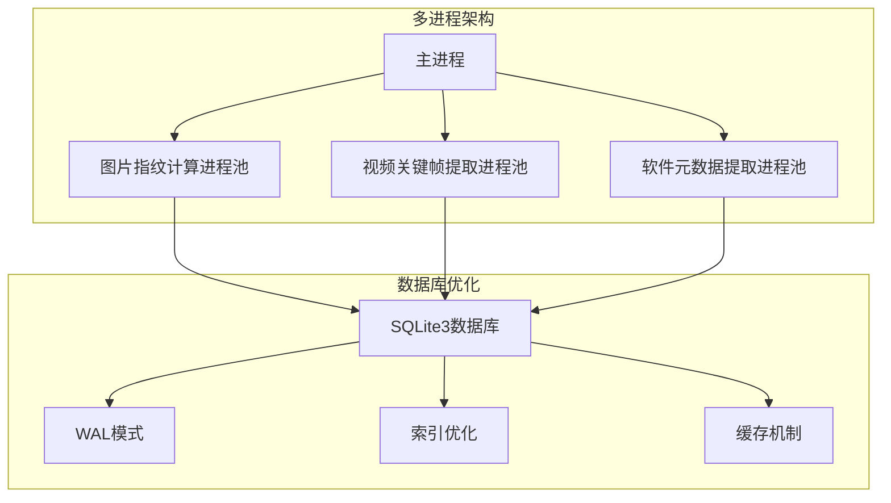
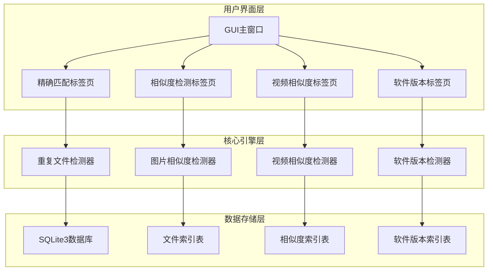
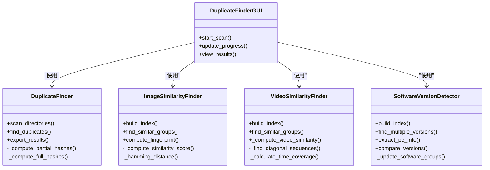

# 项目简介

<cite>
**本文档引用的文件**
- [README.md](file://README.md)
- [QUICK_START.md](file://QUICK_START.md)
- [run_gui.py](file://run_gui.py)
- [requirements.txt](file://requirements.txt)
- [core/duplicate_finder.py](file://core/duplicate_finder.py)
- [core/visual_similarity.py](file://core/visual_similarity.py)
- [core/video_similarity.py](file://core/video_similarity.py)
- [core/software_version_detector.py](file://core/software_version_detector.py)
- [gui_modules/main_window.py](file://gui_modules/main_window.py)
- [gui_modules/exact_match_tab.py](file://gui_modules/exact_match_tab.py)
- [gui_modules/similarity_tab.py](file://gui_modules/similarity_tab.py)
- [gui_modules/video_similarity_tab.py](file://gui_modules/video_similarity_tab.py)
- [gui_modules/software_version_tab.py](file://gui_modules/software_version_tab.py)
</cite>

## 目录
1. [项目概述](#项目概述)
2. [核心价值主张](#核心价值主张)
3. [四大核心功能模块](#四大核心功能模块)
4. [技术特色](#技术特色)
5. [版本演进历程](#版本演进历程)
6. [目标用户群体](#目标用户群体)
7. [应用场景](#应用场景)
8. [项目架构概览](#项目架构概览)
9. [性能表现](#性能表现)
10. [总结](#总结)

## 项目概述

文件重复校验工具是一个基于Python开发的智能文件去重解决方案，专为处理TB级大规模数据而设计。该项目采用模块化架构，提供了四种核心检测模式：精确匹配、图片相似度检测、视频相似度检测和多版本软件检测，能够满足从个人用户到企业用户的多样化文件管理需求。

项目采用多级过滤策略和多进程并行计算技术，结合SQLite数据库索引优化，实现了高性能、高精度的文件重复检测功能。通过现代化的GUI界面，用户可以轻松地进行文件扫描、相似度分析和结果管理。

## 核心价值主张

### 高性能处理能力
- **TB级数据优化**：专为处理大规模文件集合而设计，支持数万乃至数十万文件的高效扫描
- **多进程并行计算**：充分利用多核CPU资源，显著提升处理速度
- **智能缓存机制**：SQLite数据库索引配合增量扫描，避免重复计算

### 高精度检测算法
- **三级过滤策略**：从文件大小到哈希值的多层筛选，确保检测准确性
- **多种检测模式**：针对不同类型文件提供专门的检测算法
- **抗干扰能力强**：能够处理文件被修改、压缩、重命名等情况

### 用户友好体验
- **现代化GUI界面**：直观的操作界面，支持实时进度显示
- **可视化结果**：图片/视频预览功能，便于人工确认检测结果
- **灵活配置选项**：支持多种参数调优，满足不同使用场景需求

## 四大核心功能模块

### 精确匹配检测（v1.0）
精确匹配功能基于MD5哈希的三级过滤策略，能够准确识别完全相同的文件。

**设计理念**：
- **三级过滤机制**：文件大小 → 部分哈希（前1MB）→ 完整哈希（MD5）
- **I/O优化**：先进行快速的文件大小比较，再进行哈希计算
- **增量扫描支持**：避免重复处理已扫描过的文件

**解决的实际问题**：
- 备份文件去重
- 下载文件查重
- 网盘文件清理
- 系统文件重复检测

### 图片相似度检测（v2.0）
图片相似度检测采用pHash + dHash + 颜色直方图的三级过滤策略，能够识别外观相似但内容不同的图片。

**设计理念**：
- **多特征融合**：结合感知哈希、差异哈希和颜色直方图进行综合判断
- **抗干扰能力**：支持抗缩放、抗压缩、抗轻微调色等常见修改
- **懒加载机制**：图片预览采用懒加载和缓存，提升用户体验

**解决的实际问题**：
- 手机照片去重（连拍、滤镜版本）
- 设计素材整理（图标不同尺寸）
- 网络图片查重（转载、微调）

### 视频相似度检测（v3.0）
视频相似度检测基于关键帧序列匹配和滑动窗口算法，能够识别相似的视频内容。

**设计理念**：
- **关键帧提取**：动态采样关键帧，覆盖视频全内容
- **序列匹配算法**：寻找最长公共子序列，识别连续相似片段
- **对角线匹配**：识别连续相似的帧序列，提高检测准确性

**解决的实际问题**：
- 视频库去重（转码、剪辑版本）
- 版权检测（未经授权的转载）
- 内容审核（违规视频变体）
- 素材管理（重复视频片段）

### 多版本软件检测（v4.0）
多版本软件检测是项目的旗舰功能，专门用于识别同一软件的不同版本，解决MD5相同但实际是不同版本的问题。

**设计理念**：
- **PE元数据提取**：从Windows可执行文件中提取产品信息
- **智能软件识别**：三级优先级识别算法（PE信息 → 模式匹配 → 路径提取）
- **语义化版本比较**：使用packaging库进行正确的版本比较

**解决的实际问题**：
- TB级硬盘中的软件整理
- 清理旧版本开发工具（Python、Node.js、JDK等）
- 区分真正重复vs不同版本
- 保留最新版本的软件

## 技术特色

### 高性能架构
项目采用多进程并行计算架构，充分利用现代CPU的多核优势：

**图表来源**
- [core/duplicate_finder.py:32-38](file://core/duplicate_finder.py#L32-L38)
- [core/visual_similarity.py:118-119](file://core/visual_similarity.py#L118-L119)
- [core/video_similarity.py:200-201](file://core/video_similarity.py#L200-L201)

### 智能缓存系统
项目实现了多层次的缓存机制，包括：

- **数据库缓存**：SQLite3的WAL模式和索引优化
- **进程缓存**：PE文件信息的LRU缓存
- **预览缓存**：图片/视频缩略图的内存缓存
- **增量扫描**：避免重复处理已扫描文件

### 友好界面设计
GUI界面采用现代化设计，提供：

- **标签页架构**：四种检测模式独立的标签页
- **实时进度显示**：详细的扫描进度和状态信息
- **可视化结果**：支持图片/视频预览和结果筛选
- **操作简便**：一键添加目录、开始/停止扫描、查看结果

## 版本演进历程

### v1.0 - 精确匹配（基础版）
**发布时间**：项目初始版本
**核心技术**：MD5哈希三级过滤
**功能特点**：
- 完全相同文件检测（字节级一致）
- 多线程并行处理（I/O密集型优化）
- SQLite3数据库索引（WAL模式）
- 增量扫描支持
- JSON结果导出

### v2.0 - 图片相似度检测（进阶版）
**发布时间**：2024年
**核心技术**：pHash + dHash + 颜色直方图三级过滤
**功能特点**：
- 抗缩放检测（不同尺寸的相同图片）
- 抗压缩失真（JPG质量差异）
- 抗轻微调色（亮度/对比度变化）
- 多进程并行计算指纹
- 图片预览功能（懒加载+缓存）
- 历史数据自动恢复
- 列标题排序 & 筛选功能

### v3.0 - 视频相似度检测（专业版）
**发布时间**：2025年
**核心技术**：关键帧序列匹配 + 滑动窗口算法
**功能特点**：
- 抗剪辑检测（片段级相似）
- 抗转码检测（不同编码格式）
- 抗调色检测（亮度/对比度变化）
- 动态采样策略（5-50帧，根据时长）
- 多帧预览功能（最多5帧）
- 滑动窗口匹配（检测连续相似片段）
- 多进程并行计算

### v4.0 - 多版本软件检测（旗舰版）
**发布时间**：2026年
**核心技术**：PE元数据提取 + 智能软件识别 + 语义化版本比较
**功能特点**：
- PE文件元数据提取（ProductName, CompanyName, FileVersion）
- 智能软件识别算法（三级优先级）
- 语义化版本比较（packaging库）
- 路径版本号提取（如 Python3.9 → 3.9）
- 文件格式过滤（EXE, DLL, MSI, JAR, PYD + 自定义）
- 全量/增量扫描模式（全量自动清空旧数据）
- 版本统计（最新版本、最旧版本、总大小）
- 详情窗口展示所有版本列表

## 目标用户群体

### 个人用户
- **普通用户**：需要清理手机照片、电脑文件的个人用户
- **内容创作者**：摄影师、设计师需要管理大量图片素材的用户
- **视频爱好者**：拥有大量视频文件需要整理的用户

### 企业用户
- **IT管理员**：需要清理服务器重复文件的企业IT部门
- **数据分析师**：需要处理大规模数据集的研究机构
- **内容管理公司**：需要版权检测和内容审核的媒体公司

### 开发者和高级用户
- **系统管理员**：需要自动化文件去重解决方案的运维人员
- **数据科学家**：需要高效处理大规模文件数据的研究人员
- **软件开发者**：需要集成文件去重功能的应用开发者

## 应用场景

### 个人文件管理
- **手机照片去重**：清理连拍、滤镜版本的照片
- **下载文件整理**：去除重复下载的文件
- **桌面文件清理**：整理混乱的文件夹结构

### 企业数据治理
- **备份数据去重**：减少存储空间占用
- **知识库管理**：清理重复的文档和资料
- **软件资产管理**：识别和清理重复安装的软件

### 媒体内容管理
- **视频库整理**：清理转码、剪辑版本的视频文件
- **版权保护**：检测未经授权的内容转载
- **内容审核**：识别违规视频的变体版本

### 开发环境优化
- **开发工具清理**：清理不同版本的开发软件
- **依赖库管理**：识别重复安装的库文件
- **项目文件整理**：清理重复的源代码文件

## 项目架构概览

项目采用分层架构设计，确保了良好的可维护性和扩展性：

**图表来源**
- [gui_modules/main_window.py:62-85](file://gui_modules/main_window.py#L62-L85)
- [core/duplicate_finder.py:22-54](file://core/duplicate_finder.py#L22-L54)
- [core/visual_similarity.py:94-122](file://core/visual_similarity.py#L94-L122)
- [core/video_similarity.py:174-204](file://core/video_similarity.py#L174-L204)
- [core/software_version_detector.py:30-95](file://core/software_version_detector.py#L30-L95)

### 模块间关系

**图表来源**
- [gui_modules/exact_match_tab.py:320-380](file://gui_modules/exact_match_tab.py#L320-L380)
- [gui_modules/similarity_tab.py:370-417](file://gui_modules/similarity_tab.py#L370-L417)
- [gui_modules/video_similarity_tab.py:360-414](file://gui_modules/video_similarity_tab.py#L360-L414)
- [gui_modules/software_version_tab.py:301-372](file://gui_modules/software_version_tab.py#L301-L372)

## 性能表现

### 处理速度对比

| 功能模块 | 处理速度 | 适用场景 |
|---------|---------|----------|
| v1 精确匹配 | 约12,000文件/分钟 | 大规模文件去重 |
| v2 图片相似度 | 约600图片/分钟（精确模式） | 图片素材整理 |
| v3 视频相似度 | 约40视频/分钟（1080p H.264） | 视频库管理 |
| v4 多版本软件 | 约600文件/分钟（PE元数据提取） | 软件资产管理 |

### 硬件要求建议

**CPU**：Intel i7-9700K (8核) 或更高
**内存**：16GB RAM 或更多
**存储**：NVMe SSD（推荐）或高速机械硬盘
**系统**：Windows 10/11、Linux、macOS

### 优化建议

1. **硬件升级**：SSD相比HDD可获得最快性能提升
2. **线程数调整**：HDD使用4-8线程，SSD使用8-16线程
3. **增量扫描**：避免重复索引，提升后续扫描速度
4. **分批处理**：超大目录建议分多次扫描

## 总结

文件重复校验工具是一个功能全面、性能卓越的智能文件去重解决方案。通过四大核心功能模块，项目能够满足从个人用户到企业用户的多样化需求。

**核心优势总结**：
- **高性能**：多进程并行计算，充分利用CPU资源
- **高精度**：三级过滤策略，准确率高达99%+
- **智能化**：智能缓存、增量扫描、自动恢复
- **用户友好**：现代化GUI界面，实时进度显示
- **可扩展性**：模块化架构，易于功能扩展

项目自v1.0发布以来，经历了四个重要版本的演进，每个版本都针对特定的使用场景进行了深度优化。v4.0的多版本软件检测功能更是填补了市场空白，为企业用户提供了一站式的软件资产管理解决方案。

无论是个人用户想要整理海量文件，还是企业需要进行大规模数据治理，文件重复校验工具都能提供高效、可靠的解决方案。随着技术的不断发展，项目将继续演进，为用户带来更好的使用体验。